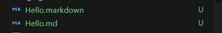
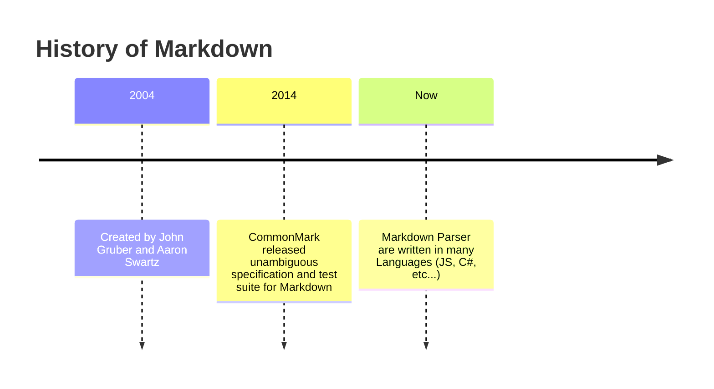
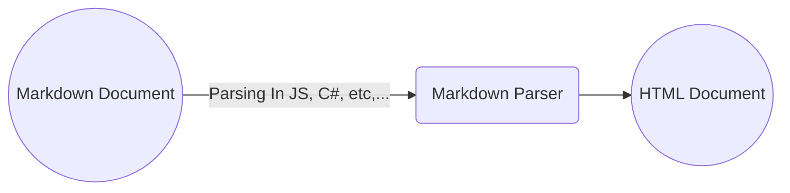

# Git Markdown
A language that is specifically to *markdown* **Documentations** more *interesting!* :art:

## What is Git Markdown?
### Reason why I built this repo:
- To test it is felt to writing in **Markdown :book:** 
- To master Documentation **master** at writing **Documentation** :open_book:
- To fully immersive with **CODE** :t-rex:
- To draw diagram :framed_picture: with **only using Markdown :art:**

### Problem it solve:
- Make a **World of Documentation** more meaningful :+1: 

## Features
- Make **Documentation** more colorful :red_square::green_square::blue_square:

## How to Install
1. Download [Visual Studio Code](https://code.visualstudio.com/) :writing_hand: (or any Code Editor that support **Markdown** :computer:)
   
2. Download [Markdown Extension](bierner.github-markdown-preview) on Visual Studio Code

## How to Use 
1. Read some instructions on how to write in on this page :point_right: **[Tutorial How To Write Markdown](https://docs.github.com/en/get-started/writing-on-github/getting-started-with-writing-and-formatting-on-github/basic-writing-and-formatting-syntax)**
   
2. Test it out on **Visual Studio Code**: :writing_hand:
   
    1. Create a file that end with *.md* or *.markdown*  
    Ex: 

    2. **TEST IT OUT!!!** :writing_hand:
   
3. Feel the power of **Markdown!** :100:

## Technologies

### How Markdown can be previewed

## Collaborators
> [!NOTE] 
> Author: @SadNguyen2107  
> Maybe will be still writing in the **Future** :compass:

## License
Copyright :copyright: SadNguyen217. All rights reserved.

Licensed under the [MIT](LICENSE) license.